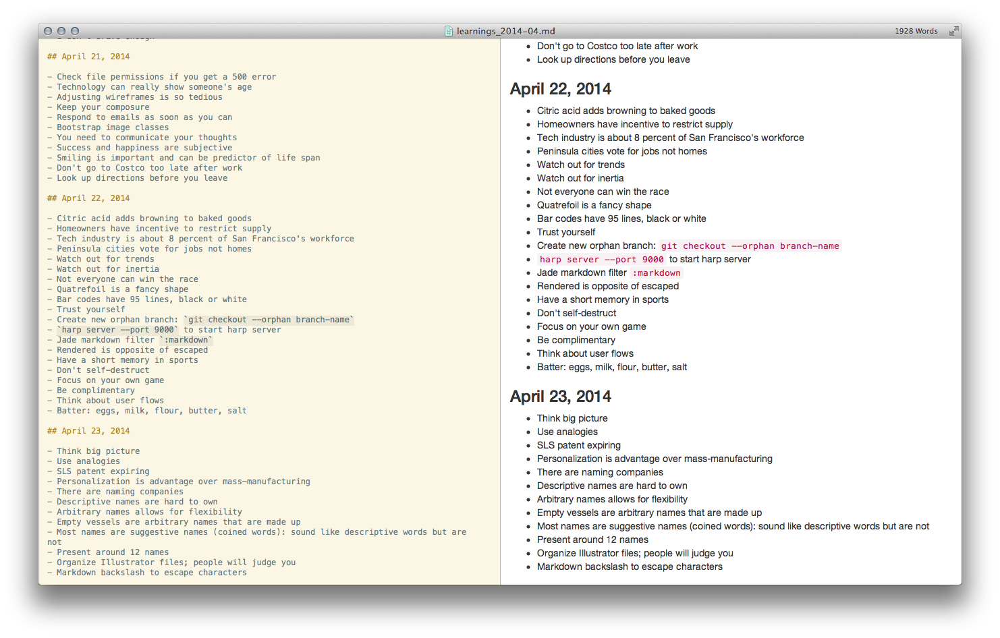

# Mou

[Mou](http://mouapp.com/) themes and CSS collection.

## Themes

- **Solarized (Light).txt** and **Solarized (Light) +.txt** &mdash; from [Code Catalyst / mou-theme-solarized](https://github.com/CodeCatalyst/mou-theme-solarized)

## CSS

- **Bootstrap.css** &mdash; Custom version based off [Bootstrap](http://getbootstrap.com) styles.

*Mou screenshot using Solarized (Light) theme and Bootstrap CSS.*